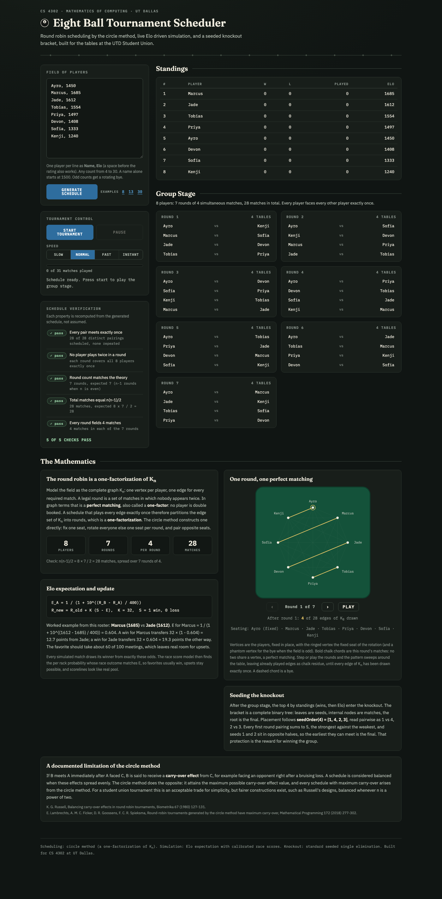

# Pool Tournament Scheduler

A single file web app that schedules and simulates a complete eight ball tournament: a circle method round robin group stage, live Elo driven match simulation, and a seeded single elimination bracket.

Built for CS 4302 (Mathematics of Computing) at UT Dallas. The eventual real world use is running a pool tournament at the UTD Student Union.



## Run it

Open `index.html` in any modern browser, straight from the file system. No server, no build step, no storage APIs, no dependencies beyond Google Fonts (with system fallbacks if offline).

To test the algorithms outside the browser:

```
node test/algorithms.test.mjs
```

The runner extracts the exact algorithm block shipped inside `index.html` (framed by `[ALGO:BEGIN]` and `[ALGO:END]` markers) and runs just over 100,000 assertions against it, so the tested code and the shipped code cannot drift apart.

## What it does

1. Accepts a roster of 4 to 30 players with Elo ratings (a default field of 8 loads pre-generated; one click example fields at 8, 13, and 30; odd counts get a rotating bye)
2. Generates the round robin with the circle method and proves its correctness in a live verification panel
3. Plays every match visibly over time with Elo based odds, speed controls (slow, normal, fast, instant), pause and resume, animated standings, and a progress meter
4. Seeds the top finishers into a knockout bracket, advances winners through the tree, and crowns a champion
5. Draws the mathematics live: the K_n diagram on its felt table inks each round's perfect matching chord by chord, keeps played edges as chalk residue, and counts coverage until all n(n-1)/2 edges are drawn exactly once

## Two minute demo

1. Open `index.html`. It loads with the default eight player field already scheduled and the verification panel showing 5 of 5 checks passing.
2. Point at the group note (8 players, 7 rounds, 28 matches), then at the stat tiles in the mathematics panel where the same numbers fall out of n(n-1)/2.
3. Press Start Tournament on Normal speed. A result lands roughly every 0.7 seconds: scores fill into the schedule, standings resort, and Elo deltas flash.
4. Pause, resume, then switch the speed to Instant. The top 4 seed into the bracket and a champion is crowned.
5. Press Play on the K_n diagram. The matching sweeps the felt round by round, played edges stay as chalk residue, and the counter runs to "all 28 edges drawn exactly once". That is the one-factorization working in front of you.
6. Click the example fields (8, 13, 30). Thirteen shows the rotating bye and n rounds for odd n; thirty shows the same guarantees at 29 rounds and 435 matches, verified live.

## The mathematics

### Circle method, viewed as a one-factorization

Model the field as the complete graph K_n: one vertex per player, one edge per required match. A legal round is a perfect matching (a one-factor) of K_n, since no player may appear twice. A schedule that plays each edge exactly once across n-1 rounds partitions the edge set into one-factors: a one-factorization of K_n.

The construction: fix one player in a seat, arrange the rest in a ring, pair opposite seats each round, rotate the ring one seat between rounds. Why every pair meets exactly once: label the ring players 0..n-2. Opposite seat positions have a constant position sum, so after r rotations the pairs that meet are exactly those whose label sum falls in a fixed residue class shifted by 2r modulo n-1. Since n-1 is odd, 2 is invertible mod n-1, so the n-1 rounds sweep every residue class once and each pair of labels meets in exactly one round. The fixed player meets whichever ring player rotates into the opposite seat, a different one each round.

Odd fields add a phantom bye seat: the schedule becomes a one-factorization of K_(n+1) and the player paired with the phantom rests, so there are n rounds and each player rests exactly once.

The app's verification panel recomputes five structural properties from the generated schedule (pair coverage, no double booking, round count, total matches, matches per round) and reports pass or fail, so correctness is demonstrated rather than asserted. The mathematics panel draws the one-factorization itself: players sit as fixed vertices of K_n on a felt table, each round's perfect matching is chalked in chord by chord, played edges remain as residue, and a live counter tracks edge coverage to exactly n(n-1)/2. Playing all rounds shows the matching pattern sweeping the table until the complete graph is fully inked.

### Elo simulation with calibrated race scores

Standard Elo with K = 32:

```
E_A   = 1 / (1 + 10^((R_B - R_A) / 400))
R_new = R_old + K (S - E)
```

Matches are races (first to 5 racks, final to 7). If the per rack win probability is q, the match win probability is the negative binomial tail sum of C(raceTo-1+k, k) q^raceTo (1-q)^k for k = 0..raceTo-1. Using E directly as the rack probability would let the race amplify favorites, so the app inverts that formula by bisection to find the q whose match win probability equals E. Result: match outcomes follow the Elo odds exactly (verified by a 40,000 trial Monte Carlo in the test suite) while scorelines stay realistic. Ratings update live during play, and later matches are simulated at the updated ratings.

### Seeded single elimination

The bracket is a complete binary tree: leaves are seeds, internal nodes are matches, the root is the final. Seeds come from group standings (wins, then current Elo). Placement follows the standard doubling construction, seedOrder(4) = [1, 4, 2, 3] and seedOrder(8) = [1, 8, 4, 5, 2, 7, 3, 6], read pairwise as first round matches. Every first round pairing sums to k+1 and the strongest seeds land in opposite halves, so seeds 1 and 2 can only meet in the final. Fields of 12 or more send the top 8; smaller fields send the top 4.

### Known limitation, acknowledged

The circle method is correct but maximally unbalanced with respect to the carry-over effect (receiving an opponent right after that opponent's previous match affects them). Russell (1980) showed balanced carry-over is achievable when n is a power of two; Lambrechts, Ficker, Goossens, and Spieksma (2018) proved the circle method attains the maximum possible carry-over effect value, and that every maximum carry-over schedule arises from the circle method. For a casual event the trade for simplicity is acceptable, and the app states this in its mathematics panel.

## References

- K. G. Russell, Balancing carry-over effects in round robin tournaments, Biometrika 67 (1980) 127-131.
- E. Lambrechts, A. M. C. Ficker, D. R. Goossens, F. C. R. Spieksma, Round-robin tournaments generated by the circle method have maximum carry-over, Mathematical Programming 172 (2018) 277-302.
- A. E. Elo, The Rating of Chess Players, Past and Present, Arco, 1978.
- W. D. Wallis, One-Factorizations, Kluwer, 1997.

## Code map

Everything lives in `index.html`, organized into commented sections:

1. Pure algorithms (circle method, verification, Elo, race model, seeding), DOM free and extracted by the test runner
2. Roster parsing and validation
3. App state (plain in-memory variables, no localStorage or sessionStorage)
4. Rendering (standings, schedule, bracket, verification, mathematics panel, K_n diagram)
5. Simulation loop (timed queue, speeds, pause and resume, instant drain)
6. Event wiring and boot

## Acceptance checklist

- 8 players produce exactly 7 rounds of 4 matches, 28 total: yes, shown in the group note and stat tiles
- Verification panel passes all checks: yes, 5 of 5 for every count 4 through 16 (also covered by the Node tests)
- Tournament plays out visibly over time with live standings and Elo updates: yes
- Pause, resume, and all four speeds work, including switching mid run: yes
- Top finishers advance into a correctly seeded bracket and a champion is crowned: yes
- Odd player counts produce rotating byes without breaking: yes, each player rests exactly once
- Scales beyond the assignment's 4 to 16: fields up to 30 players keep every guarantee (29 rounds, 435 matches, all checks passing, Elo conserved)
- Mathematics panel explains the one-factorization, the Elo formula with a live worked example, and the seeding rule: yes
- No em dashes in the interface: yes, enforced
